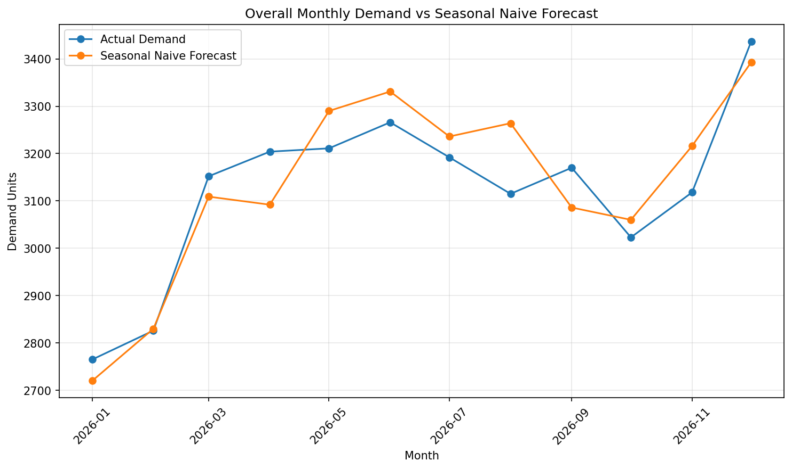
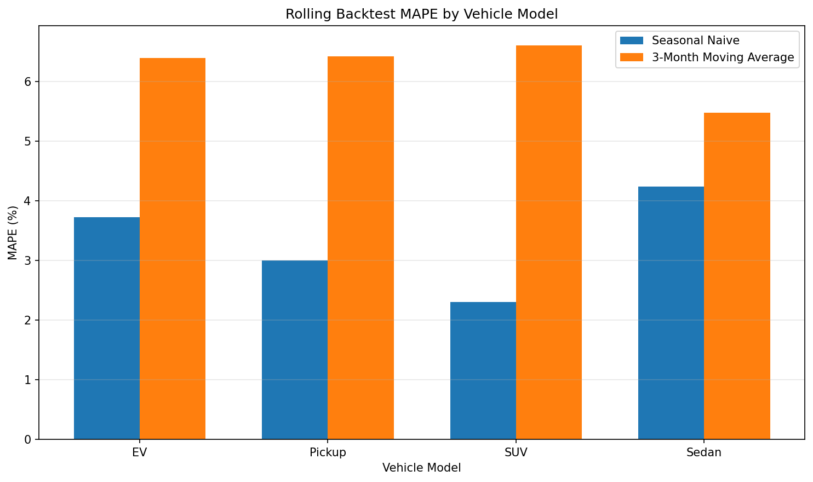

# Automotive Sales & Inventory Planning Analytics

An automotive planning analytics project that combines public U.S. automotive market data with synthetic dealer operations data to analyze demand forecasting, inventory management, production planning, dealer performance, and promotion strategy.

The project uses **Python, pandas, SQL, SQLite, Matplotlib, and Tableau** to build a complete analytics workflow from raw data through business diagnostics and management reporting.

## Project Objective

Automotive planning teams must continuously balance several priorities:

* Forecast customer demand
* Maintain sufficient dealer inventory
* Avoid excess inventory
* Align production with expected demand
* Identify regional supply pressure
* Support dealer planning
* Evaluate promotional actions

This project simulates that analytical workflow using:

1. Public U.S. automotive market indicators
2. Synthetic dealer operations data
3. Python and pandas analysis
4. Demand forecasting and rolling backtesting
5. SQL business diagnostics
6. Tableau dashboard reporting

The goal is not to build a production grade automotive forecasting system. Instead, the project demonstrates how data can support practical sales, inventory, production, dealer, and promotion planning decisions.

## Business Questions

### Sales Forecasting

* How accurately can simple forecasting baselines predict monthly vehicle demand?
* Does recent demand or annual seasonality provide a stronger planning signal?
* Which forecasting approach performs more consistently across vehicle segments?

### Inventory Management

* Which dealers or vehicle models are carrying relatively high inventory?
* Where are stockouts occurring?
* Which dealer and vehicle combinations may require inventory review versus additional supply?

### Production Planning

* Is demand being underestimated?
* Is production falling below forecast?
* Are forecast or production gaps creating actual stockout pressure?
* Which region and vehicle combinations require planning review?

### Dealer Support

* Which dealers have weaker demand fulfillment?
* Which dealers are experiencing supply pressure?
* Which dealers may require inventory or forecast review?

### Promotion Planning

* Which vehicle models receive promotions most frequently?
* How large are promotion discounts?
* Does the assumed demand lift exceed the revenue break even lift?
* Which promotions appear expected revenue positive under the synthetic assumptions?

## Data

### Public Automotive Market Data

Public macroeconomic automotive data was collected from FRED.

The project uses the following series:

| Series | Description |
| --- | --- |
| `TOTALSA` | Total Vehicle Sales |
| `AUINSA` | Domestic Auto Inventories |
| `MRTSSM441USS` | Motor Vehicle & Parts Dealer Sales |
| `MRTSIM441USS` | Motor Vehicle & Parts Dealer Inventories |

The common historical window covers approximately:

```text
2000-01 through 2026-07
```

These series provide broader market context for sales and inventory conditions.

### Synthetic Dealer Operations Dataset

Because real dealer operations data is not publicly available for this project, a synthetic dataset was generated for operational planning analysis.

#### Dataset Grain

```text
1 row = 1 month × 1 dealer × 1 vehicle model
```

#### Dataset Dimensions

```text
24 months
8 dealers
4 vehicle models

24 × 8 × 4 = 768 rows
```

#### Regions

* Northeast
* South
* Midwest
* West

#### Vehicle Models

* EV
* Pickup
* SUV
* Sedan

The synthetic dataset includes fields such as:

* forecast units
* demand units
* production units
* beginning inventory
* ending inventory
* sales units
* lost sales
* inventory to sales ratio
* promotion flag
* promotion discount
* assumed promotion demand lift
* revenue
* expected revenue tradeoff

### Data Disclaimer

The dealer operations dataset is **synthetic**.

It does not represent actual operations, pricing, inventory, customers, dealers, production data, or business performance from any automotive company.

Promotion response assumptions and diagnostic thresholds are also synthetic and are used only to demonstrate analytical workflows.

They should not be interpreted as automotive industry benchmarks.

## Project Architecture

```text
Public Market Data
        |
        v
Data Cleaning and Market Analysis
        |
        +----------------------+
        |                      |
        v                      v
Synthetic Dealer Data     Market Context
        |
        v
Python and pandas Analysis
        |
        +------------------------------+
        |              |               |
        v              v               v
Dealer Analysis   Production       Promotion
                 Planning          Analysis
        |
        v
Demand Forecasting
        |
        v
Rolling Backtest
        |
        v
SQLite Database
        |
        v
SQL Business Analysis
        |
        v
Dashboard Ready CSV Exports
        |
        v
Tableau Dashboard
```

## Analysis Workflow

### 1. Automotive Market Analysis

The public market dataset was used to examine the relationship between automotive dealer inventory and sales.

Key metrics include:

* Inventory to Sales Ratio
* Sales YoY Growth
* Inventory YoY Growth
* Inventory Growth Gap

A recent market inventory comparison was used to evaluate whether current inventory conditions appear relatively normal or elevated.

The analysis found that inventory levels appear elevated relative to the more recent market environment, while the three month inventory growth gap was not unusually high.

This supports a monitoring response rather than automatically assuming immediate production changes are required.

### 2. Dealer Performance Analysis

Dealer metrics were calculated across the synthetic operations dataset.

Metrics include:

* total demand
* total sales
* total revenue
* lost sales
* forecast MAPE
* average ending inventory
* inventory to sales ratio
* stockout rate
* demand fulfillment rate
* promotion rate
* production demand gap

Synthetic diagnostic flags were created for:

* Supply Pressure
* Inventory Pressure
* Forecast Review

Example findings include:

* `MW_D01` and `MW_D02` showed relatively elevated inventory conditions without meaningful stockout pressure.
* `NE_D01` and `NE_D02` showed supply pressure.
* `WE_D01` showed both supply pressure and weaker forecast accuracy.
* `SO_D01` maintained full demand fulfillment in the synthetic dataset.

These flags use internal analytical thresholds rather than industry standards.

### 3. Inventory Risk Analysis

Inventory analysis was performed at the following grain:

```text
dealer × vehicle model
```

Metrics include:

* average ending inventory
* average inventory to sales ratio
* demand fulfillment rate
* stockout rate
* promotion rate
* average promotion discount
* expected revenue tradeoff

Example higher inventory combinations include:

* `MW_D02 Pickup`
* `WE_D02 EV`
* `MW_D01 Pickup`
* `MW_D02 Sedan`
* `NE_D01 Pickup`

The analysis distinguishes between:

* Inventory Review
* Supply Review
* Timing or Allocation Review

This helps avoid treating every inventory or supply condition as the same operational problem.

### 4. Production Planning Analysis

Production planning was analyzed at the following grain:

```text
region × vehicle model
```

Three planning gaps were evaluated.

#### Forecast vs Demand

```text
Forecast - Demand
```

Negative values indicate that the forecast underestimated demand.

#### Production vs Forecast

```text
Production - Forecast
```

Negative values indicate that production was below the planned forecast.

#### Production vs Demand

```text
Production - Demand
```

This provides additional context but is not treated alone as evidence of a production problem because beginning inventory can buffer temporary demand gaps.

The analysis also considers:

* stockout rate
* demand fulfillment rate
* ending inventory

#### Planning Diagnoses

Each region and vehicle model combination is classified as:

* Balanced
* Forecast Issue
* Production Issue
* Mixed Issue
* Inventory or Timing Review

Example results:

| Region | Vehicle Model | Diagnosis |
| --- | --- | --- |
| Northeast | SUV | Production Issue |
| Northeast | Sedan | Mixed Issue |
| West | EV | Production Issue |
| West | Pickup | Forecast Issue |
| West | SUV | Production Issue |
| West | Sedan | Mixed Issue |

Most Midwest and South combinations remained balanced in the synthetic dataset.

### 5. Promotion Analysis

Promotions were modeled using synthetic discount and demand response assumptions.

For promoted observations, the analysis compares:

```text
Assumed Demand Lift
vs.
Break Even Demand Lift
```

The break even demand lift represents the increase in demand required to offset the reduction in unit price.

#### Promotion Results

| Vehicle | Promotion Rate | Avg Discount | Assumed Lift | Break Even Lift | Avg Expected Revenue Tradeoff |
| --- | ---: | ---: | ---: | ---: | ---: |
| EV | 15.10% | 8.71% | 10.89% | 9.60% | +$50,050 |
| Pickup | 11.98% | 8.01% | 6.81% | 8.75% | -$90,051 |
| Sedan | 6.77% | 8.20% | 9.02% | 8.97% | +$1,117 |
| SUV | 4.69% | 9.61% | 9.13% | 10.67% | -$70,703 |

Under the synthetic assumptions:

```text
EV     -> Expected Revenue Positive
Sedan  -> Expected Revenue Positive
Pickup -> Expected Revenue Negative
SUV    -> Expected Revenue Negative
```

#### Important Interpretation

`expected_revenue_tradeoff` is **not profit or ROI**.

The project does not include:

* cost of goods sold
* manufacturing margin
* advertising cost
* campaign operating cost
* dealer incentives

The metric should therefore only be interpreted as a synthetic expected revenue comparison.

## Demand Forecasting

Two simple forecasting baselines were evaluated.

### Seasonal Naive

The Seasonal Naive model predicts monthly demand using demand from the same month one year earlier.

```text
Forecast(t) = Demand(t - 12 months)
```

### 3 Month Moving Average

The moving average model predicts demand using the previous three observed months.

```text
Forecast(t) =
Average Demand(t-1, t-2, t-3)
```

The moving average forecast is evaluated as a one step ahead rolling forecast.

### Initial 6 Month Holdout

The initial holdout period covered:

```text
2026-07 through 2026-12
```

Results:

| Model | MAE | MAPE |
| --- | ---: | ---: |
| Seasonal Naive | 26.92 | 3.62% |
| 3 Month Moving Average | 35.92 | 4.38% |

A segment specific comparison initially suggested that different vehicle models could favor different forecasting approaches.

However, the same six month test period was being used for both model selection and performance evaluation.

A broader rolling backtest was therefore added.

## 12 Month Rolling Backtest

The rolling backtest evaluates both forecasting approaches across all months in 2026.

```text
12 months × 4 vehicle models = 48 forecast observations
```

### Overall Results

| Model | MAE | MAPE |
| --- | ---: | ---: |
| Seasonal Naive | **24.79** | **3.32%** |
| 3 Month Moving Average | 48.35 | 6.23% |

### Results by Vehicle Model

| Vehicle | Seasonal Naive MAPE | Moving Average MAPE |
| --- | ---: | ---: |
| EV | **3.73%** | 6.40% |
| Pickup | **3.00%** | 6.42% |
| SUV | **2.31%** | 6.61% |
| Sedan | **4.24%** | 5.48% |

Seasonal Naive produced lower rolling backtest error across all four vehicle models.

For this synthetic dataset, Seasonal Naive was therefore selected as the more stable forecasting baseline.

## Forecast Visualizations

### Overall Monthly Demand vs Forecast



### Rolling Backtest Model Comparison



Additional vehicle forecasting charts are available in:

```text
dashboard/forecasting/
```

## SQL Analysis

The processed operations data is loaded into SQLite for business analysis.

Database:

```text
data/processed/automotive_analytics.db
```

The database contains:

```text
operations                  768 rows
forecast_backtest            48 rows
forecast_model_comparison     4 rows
```

Four primary SQL analyses were created:

```text
sql/
├── 01_dealer_performance.sql
├── 02_inventory_risk.sql
├── 03_production_planning.sql
└── 04_promotion_analysis.sql
```

The SQL analysis recreates the business diagnostics independently from the pandas workflow.

This allows the planning logic to be validated using both Python and SQL.

## Dashboard Ready Data Pipeline

SQL outputs are automatically exported for visualization.

```text
data/processed/dashboard/
├── dealer_performance.csv
├── inventory_risk.csv
├── production_planning.csv
└── promotion_analysis.csv
```

Expected row counts:

```text
dealer_performance.csv      8 rows
inventory_risk.csv         32 rows
production_planning.csv    16 rows
promotion_analysis.csv      4 rows
```

The export process is handled by:

```text
src/export_dashboard_data.py
```

This separates analytical logic from dashboard presentation.

## Tableau Dashboard

A Tableau dashboard is being built from the dashboard ready analytical outputs.

The dashboard currently includes the following views.

### Dealer Demand vs Sales

Compares dealer total demand and actual sales.

### Dealer Risk Summary

Summarizes operational diagnostic flags across dealers.

### Inventory Risk by Dealer and Model

Uses a heatmap to identify relatively high inventory to sales ratios across dealer and vehicle combinations.

### Production Planning Diagnosis

Displays region and vehicle planning classifications:

* Balanced
* Forecast Issue
* Production Issue
* Mixed Issue

### Expected Revenue Tradeoff by Vehicle Model

Compares synthetic promotion revenue tradeoffs across vehicle models.

### Tableau Dashboard Preview

The final Tableau Public dashboard screenshot and public link will be added after dashboard development is complete.

Planned image location:

```text
docs/images/tableau_dashboard.png
```

After the final dashboard is complete, this section will include:

```markdown

```

A Tableau Public link will also be added here.

## Technology Stack

### Data Analysis

* Python
* pandas
* NumPy

### Forecasting

* Seasonal Naive
* 3 Month Moving Average
* MAE
* MAPE
* Rolling Backtesting

### Database and SQL

* SQLite
* SQL
* CTEs
* CASE WHEN
* GROUP BY
* aggregate functions
* business diagnostic rules

### Visualization

* Matplotlib
* Tableau Public

### Development

* VS Code
* Git
* GitHub
* Python virtual environment

## Repository Structure

```text
automotive-sales-inventory-analytics/
│
├── data/
│   ├── raw/
│   ├── processed/
│   │   ├── automotive_analytics.db
│   │   ├── forecast_model_comparison.csv
│   │   ├── forecast_rolling_backtest.csv
│   │   └── dashboard/
│   │       ├── dealer_performance.csv
│   │       ├── inventory_risk.csv
│   │       ├── production_planning.csv
│   │       └── promotion_analysis.csv
│   │
│   └── synthetic/
│       └── synthetic_operations.csv
│
├── dashboard/
│   └── forecasting/
│       ├── ev_actual_vs_forecast.png
│       ├── pickup_actual_vs_forecast.png
│       ├── sedan_actual_vs_forecast.png
│       ├── suv_actual_vs_forecast.png
│       ├── model_mape_comparison.png
│       └── overall_actual_vs_forecast.png
│
├── notebooks/
│
├── sql/
│   ├── 01_dealer_performance.sql
│   ├── 02_inventory_risk.sql
│   ├── 03_production_planning.sql
│   └── 04_promotion_analysis.sql
│
├── src/
│   ├── explore_data.py
│   ├── build_demand_forecast.py
│   ├── visualize_forecast.py
│   ├── analyze_dealer_performance.py
│   ├── analyze_production_planning.py
│   ├── build_sql_database.py
│   └── export_dashboard_data.py
│
├── requirements.txt
└── README.md
```

Repository contents may continue to evolve as dashboard development is completed.

## Running the Project

### 1. Clone the Repository

```bash
git clone https://github.com/shawnkang0818/automotive-sales-inventory-analytics.git
cd automotive-sales-inventory-analytics
```

### 2. Create a Virtual Environment

```bash
python3 -m venv .venv
source .venv/bin/activate
```

### 3. Install Dependencies

```bash
pip install -r requirements.txt
```

### 4. Build Demand Forecasting Analysis

```bash
python src/build_demand_forecast.py
```

### 5. Generate Forecast Visualizations

```bash
python src/visualize_forecast.py
```

### 6. Build the SQLite Database

```bash
python src/build_sql_database.py
```

### 7. Run SQL Analysis

Example:

```bash
sqlite3 -header -column \
data/processed/automotive_analytics.db \
< sql/01_dealer_performance.sql
```

### 8. Export Dashboard Ready Data

```bash
python src/export_dashboard_data.py
```

## Key Takeaways

This project demonstrates a complete analytical workflow connecting:

```text
market data
→ demand modeling
→ forecasting
→ inventory analysis
→ production planning
→ dealer diagnostics
→ promotion analysis
→ SQL
→ Tableau
```

Several broader lessons emerged from the analysis:

1. Forecast performance should be evaluated over multiple periods rather than relying on a single holdout window.

2. Production below demand does not automatically indicate a production problem because inventory can buffer temporary demand gaps.

3. Stockout and fulfillment metrics help distinguish actual supply pressure from simple forecast or production variance.

4. High inventory and stockouts should not automatically be treated as the same operational issue.

5. Promotion effectiveness depends on whether assumed demand response is sufficient to offset price reductions.

6. Simple forecasting baselines can remain useful when demand contains strong seasonal patterns.

## Limitations

This project intentionally uses simplified assumptions.

Important limitations include:

* dealer operations are synthetic
* promotion demand response factors are simulated
* diagnostic thresholds are analytical assumptions rather than industry standards
* revenue analysis does not include margin or cost structure
* forecasting uses simple baseline models
* the dealer operations dataset covers a limited 24 month period
* real automotive supply chains include additional constraints such as supplier lead time, manufacturing capacity, logistics, pricing strategy, incentives, model lifecycle, and macroeconomic conditions

The analysis should therefore be interpreted as a demonstration of analytical methodology rather than a real automotive operating model.

## Future Improvements

Potential extensions include:

* longer dealer time series
* exponential smoothing or Holt Winters forecasting
* forecast confidence intervals
* dealer allocation optimization
* days of supply analysis
* supplier lead time modeling
* production capacity constraints
* regional demand scenarios
* promotion scenario simulation
* Tableau dashboard actions and interactive filtering
* automated dashboard refresh workflows

## Author

**Shawn Kang**

B.B.A. in Computer Information Systems, Data Analytics  
Baruch College

GitHub:  
https://github.com/shawnkang0818